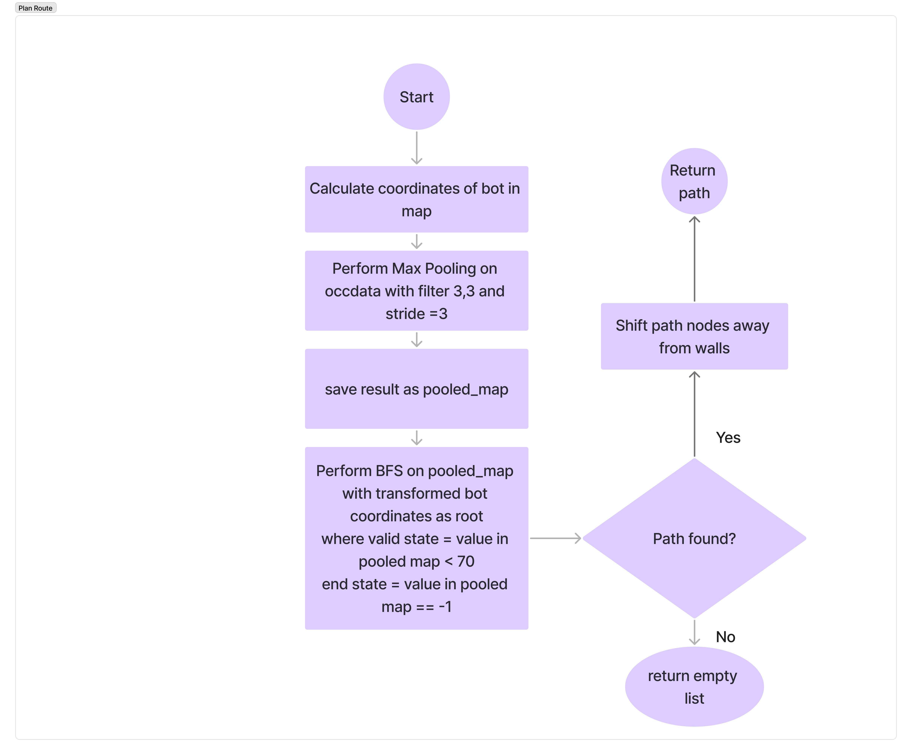
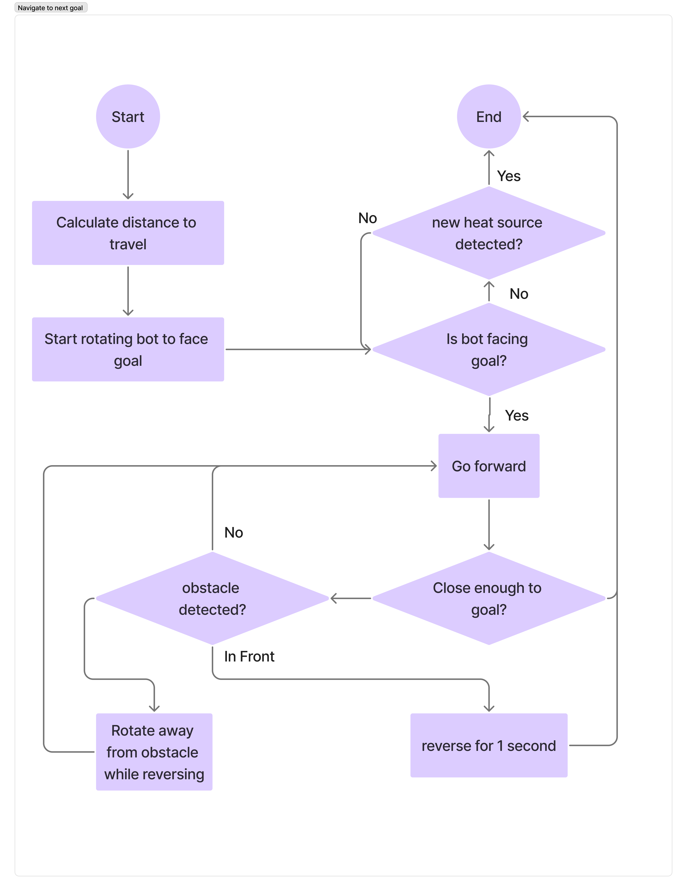
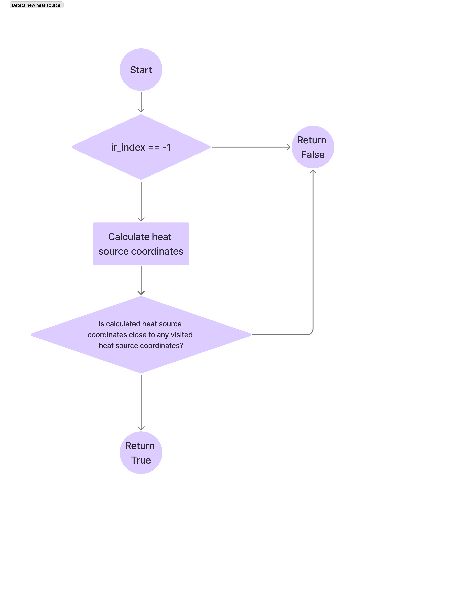
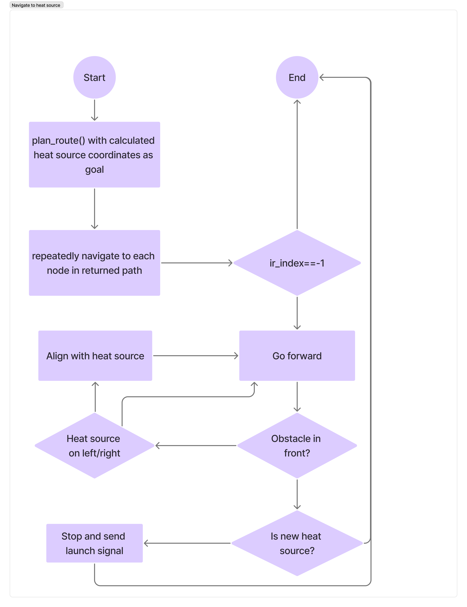
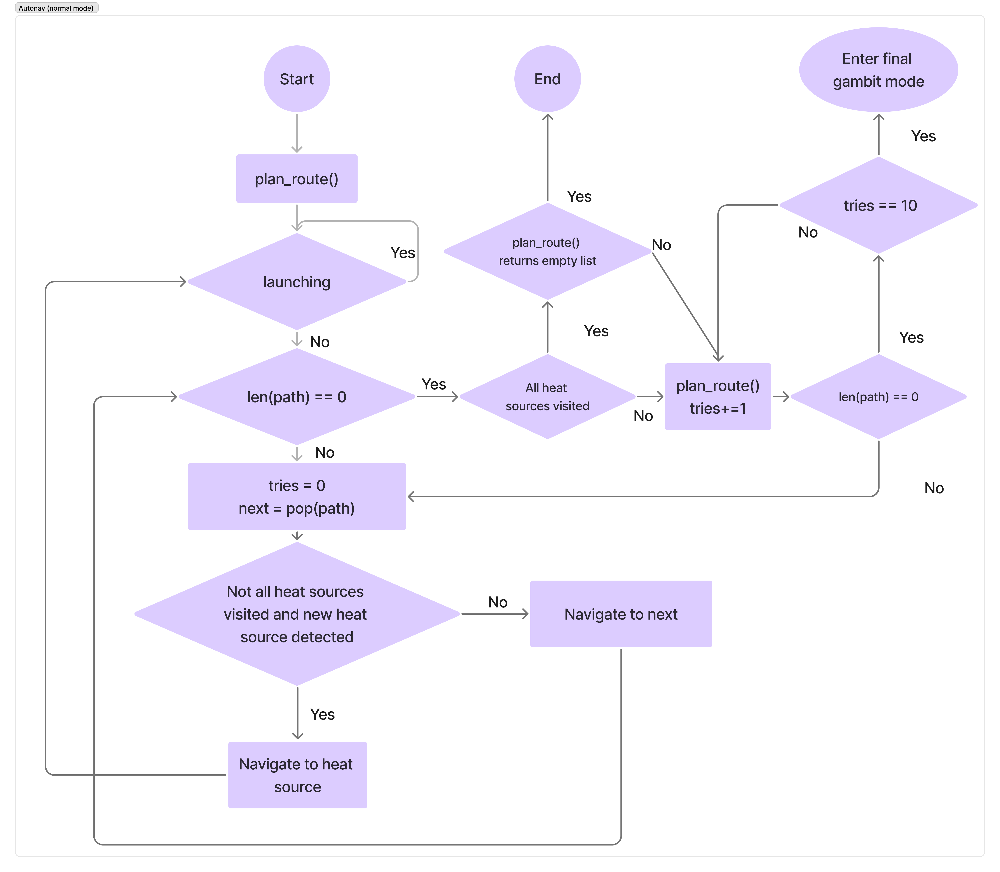
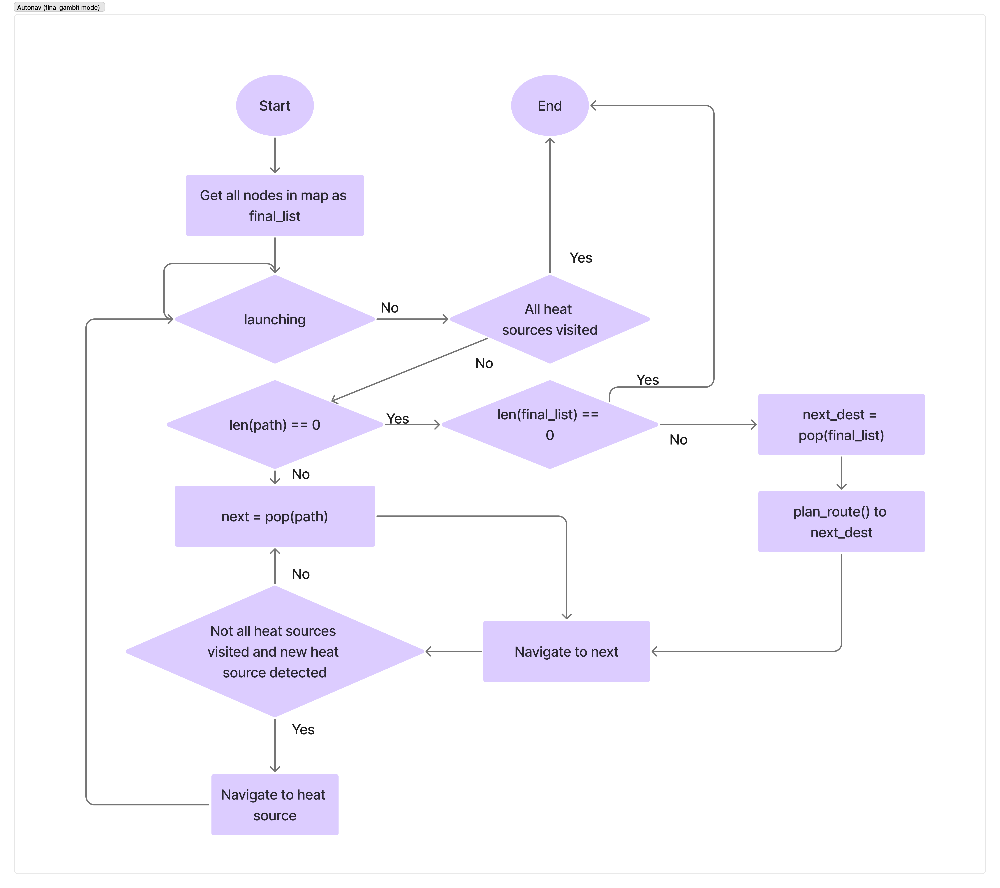
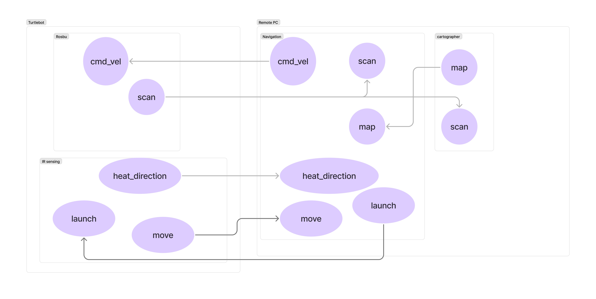

# Developer Guide for Turtlebot ICBM Navigation
This document describes the high-level design of the navigation constructs of the Turtlebot ICBM.

## Map Node
API: `mapNode.py`

A helper class to encapsulate coordinates during the BFS process in `plan route`

### Attributes:
* `x` : The x coordinates of the Node in the map published by map **or** with respect to map_frame
* `y` : the y coordinates of the Node in the map published by map **or** with respect to map_frame
* `parent` : The parent of the Node, used in search.

### Methods:
####  get_neighbors():
* Arguments:
    * `max_x` : the maximum value along the x_axis of the map
    * `max_y` : the maximum value along the y_axis of the map
* Returns: 
    * A list of neighboring nodes in the map.

## AutoNav Node
API: `r2auto_nav.py`

The main navigation control node for the Turtlebot ICBM.

### Tunable parameters
* `heat_source_radius` : The minimum distance (meters) between heat sources, used to verify whether a heat source has been detected or not.
* `heat_sources` : The number of heat sources to detect.
* `rotatechange` : The angular velocity (radians/second) of the Turtlebot ICBM when rotating.
* `speedchange` : The linear velocity (meters/second) of the Turtlebot ICBM when going in a straight line
* `stop_distance`, `side_distance`, `edge_distance` : The threshold distances of whether there is an object in front/side/edge of the Turtlebot ICBM.

### Attributes
* `publisher_` : A `Twist` publisher that controls movement of the Turtlebot ICBM. 
* `path` : A list of nodes that the Turtlebot ICBM should navigate to.
* `next_coords` : The next node that the Turtlebot ICBM will navigate to.
* `bonk_count` : A counter recording the amount of times the Turtlebot ICBM has almost ran into a wall. `path` is recalculated if a certain count is exceeded.
* `spin_coords` : A list of nodes that the Turtlebot ICBM has spun at.
* `occ_subscription` : A subscriber that subscribes to the `map` topic.
* `occ_data` : Represents the map occupancy from data provided by `occ_subscription`.
* `map_res`, `map_origin` : map data used to determine the location of the Turtlebot ICBM in `occ_data`.
* `scan_subscription` : A subscriber that subscribes to the `scan` topic.
* `laser_range` : A list of distances from each angle of the Turtlebot ICBM.
* `back_range` : A list of angles representing the back side of the Turtlebot ICBM.
* `default_front_range` : A list of angles representing the front side of the Turtlebot ICBM, only used when the Turtlebot ICBM is potentially stuck.
* `tf_buffer`, `tf_listener` : Used to determine the coordinates of the Turtlebot3 ICBM with respect to the `map` frame.
* `visited_heat_sources` : A list of coordinates representing the location of heat sources already identified.
* `ir_index` : An integer representing the column of the highest temperature that exceeds the threshold detected in the heat map. The value is -1 if there is no heat source identified.
* `heat_map_subscriber` : A subscriber that subscribes to the `heatdir` topic.
* `launching` : Represents whether the Turtlebot ICBM is currently firing flares.
* `rpi_publisher` : A `Int8` publisher that signals the flare launching sequence.
* `rpi_subscriber` : A subscriber that subscribes to the `move` topic.


### Methods

#### get_orientation
* Arguments: None
* Returns: The x and y coordinates of the Turtlebot3 ICBM and its current angle with respect to the `map` frame

#### rotate_bot
* Arguments: 
    * `rot_angle` : The angle (degrees) of which the Turtlebot3 ICBM should rotate.
    * `speed` : The linear velocity (meters/second) of the Turtlebot3 ICBM when rotating.
* Returns: None
* Effects: The Turtlebot3 ICBM will rotate `rot_angle` degrees.

#### stop_bot
* Arguments: None
* Returns: None
* Effects: The Turtlebot3 ICBM will stop in place.

#### plan_route
* Arguments: 
    * `visualize` : Whether the planned route should be displayed/saved
    * `goal` : The coordinates that the Turtlebot ICBM wants to navigate to.
* Retuns: A list of nodes to travel to until the goal is reached. If no goal is specified, a path to the nearest unexplored area is returned.
* Effects: If `visualize` is True, then copies of maps containing different information will be saved.


#### visualize path
* Arguments:
    * `path` : A list of coordinates to visualize
    * `poolex_occ_grid` : The map to visualize on
* Returns: Nothing
* Effects: copies of maps containing different information will be saved and the current path of the Turtlebot ICBM will be shown on screen.

#### travel_to_node
* Arguments:
    * `next_node` : The destination to travel to
* Returns: Nothing
* Effects: The Turtlebot ICBM will move towards the next node


#### get_distance_to_next_node
* Arguments:
    * `next_node` : The destination to travel to
* Returns: The distance from the Turtlebot ICBM to next_node

#### find_path_to_heat_source
* Arguments: None
* Returns: A path to the heat_source, assuming there is a heat source in front.

#### verify_heat_source
* Arguments: 
    * `proximity_threshold` : The minimum distance (meters) between heat sources.
* Returns: True if a new heat source is detected, False otherwise.


#### approach_heat_source
* Arguments: None
* Returns: None
* Effects: The Turtlebot ICBM will constantly go in the direction of the heat source.


#### save_heat_source_map
* Arguments: None
* Returns: None
* Effects: A copy of the occupancy map with visited heat sources marked is saved.

#### scan_front_obstacle
* Arguments: None
* Returns: A string representing where an obstable is located relative to the Turtlebot ICBM.

#### mover
* Arguments: None
* Returns: None
The main program of the Turtlebot ICBM. Currently has 2 modes (normal and final gambit) which affects the navigation algorithm.




### ROS2 topics graph
 


## Testing guide
To test certain components of the Turtlebot ICBM, it is recommended to write tests in their own file(s) and put them in the `tests` folder.

This section will go over the recommended steps to set up testing on the Turtlebot ICBM.

1. Comment out `self.mover` in `main`.
```python
def main(args=None):
    rclpy.init(args=args)

    auto_nav = AutoNav()
    try:
        #auto_nav.mover()
    except KeyboardInterrupt:
        auto_nav.get_logger().info('Keyboard interrupt, shutting down')

    finally:
        auto_nav.stopbot()
``` 

2. Add in your test function (assume testing `to_test` in `function_test.py` which takes in auto_nav as an argument).

```python
import auto_nav.tests as robot_tests
def main(args=None):
    rclpy.init(args=args)

    auto_nav = AutoNav()
    try:
        #auto_nav.mover()
        robot_tests.function_test.to_test(auto_nav)
    except KeyboardInterrupt:
        auto_nav.get_logger().info('Keyboard interrupt, shutting down')

    finally:
        auto_nav.stopbot()
```

3. Build `auto_nav` in the designated workspace.
```bash
$ cd ~/turtlebot_ws
$ colcon build 
$ source install/setup.bash
```

4. Run `auto_nav`.
```bash
$ ros2 run auto_nav r2auto_nav
```